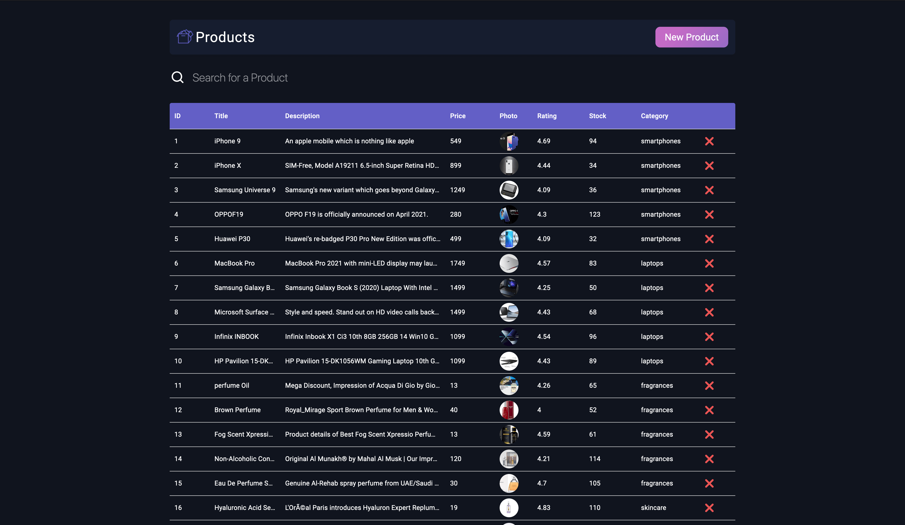

# SheepFish Test Task

## Table of contents

- [Overview](#overview)
  - [The challenge](#instruction)
  - [Screenshot](#screenshot)
  - [Links](#links)
- [My process](#my-process)
  - [Built with](#built-with)
  - [What I learned](#description)
- [Author](#author)

## Overview

### Instruction

- Clone this project to your computer and run <code>npm i</code> to install all dependencies
- Run <code>npm start</code> to start live server.

### Screenshot

### Links

- [Solution URL](https://github.com/superpooperxxx/sheep-fish__test-task)
- [Live Site URL](https://superpooperxxx.github.io/sheep-fish__test-task/)

## My process

### Built with

- React, react-router
- Redux, Redux-toolkit, react-redux
- TypeScript
- Formik, Yup
- MaterialUI, Sass
- BEM methodology: [BEM](https://en.bem.info/methodology/)
- ESlint, husky, lint-staged, CI/CD
- Semantic HTML5 markup
- CSS3: Flexbox
- Mobile-first workflow

### Description

You are able to:

- Load data from API, post new product and delete product.
- Search products by title or category.
- Filter and sort product by each column.

Website contains:

- 2 pages (products and not-found)
- Product page contains Search bar, Form to create new product, table with products and title.

## Author

- Github - [superpooperxx](https://github.com/superpooperxxx)
- LinkedIn - [Kyrylo Haiduk](https://www.linkedin.com/in/kyrylo-haiduk/)
- Telegram - [@haidukwork](https://t.me/haidukwork)
- Frontend Mentor - [@superpooperxxx](https://www.frontendmentor.io/profile/superpooperxxx)
